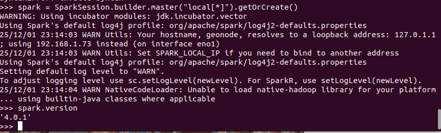

### I. Архитектура решения.

Инициализация:

### II. Ключевые статистики (по текущему датасету)

**Объём данных**

• 472 пациента, 472 рентген-снимка грудной клетки.

• 4 уникальных диагноза (класса): 

COVID-19, Pneumonia, Normal, Other.

• Средний возраст пациентов ≈ 54 года (диапазон 18–94 лет).

**Баланс классов**

• Распределение по диагнозам:

  – COVID-19 — 312 снимков (≈66%)
  
  – Pneumonia — 112 (≈24%)
  
  – Other — 37 (≈8%)
  
  – Normal — 11 (≈2%)

• Перекос классов: датасет сильно доминирует классом COVID-19.

• Редкие классы (если считать редкими \<20 наблюдений):

  – Normal — 11 снимков (≈2.3% выборки).

**Разметка и location (view)**

• Распределение снимков по view:

  – PA — 149 (≈31.6%)
  
  – AP — 140 (≈29.7%)
  
  – AP Supine — 98 (≈20.8%)
  
  – L — 51 (≈10.8%)
  
  – Axial — 33 (≈7.0%)
  
  – AP Erect — 1 (≈0.2%)

• В среднем диагнозов:

  – на пациента: ≈1.0 (312+112+37+11 пациентов при таком же числе исследований);
  
  – на снимок: 1 диагноз (один целевой класс на одно исследование).

• Замечание по полу (для ключевых классов):

  – COVID-19: 56% мужчин, 32% женщин, 11% без указания пола;
  
  – Pneumonia: 54% мужчин, 38% женщин, 8% без указания пола.
  
### III. Визуализации и выводы

**Выводы по ключевым статистикам датасета**

**1. Объём и состав данных.**
   Датасет небольшой (472 пациента и 472 снимка), с одним диагнозом на каждый снимок, что упрощает постановку задачи (многоклассовая классификация), но ограничивает обобщающую способность моделей.

**2. Сильный дисбаланс классов.**
   Класс COVID-19 существенно доминирует (≈66% данных), тогда как Normal и частично Other представлены крайне слабо. Это создаёт риск того, что модель будет «игнорировать» редкие классы и переобучаться на COVID-19, поэтому при обучении потребуется использовать методы борьбы с дисбалансом (взвешивание классов, oversampling/undersampling и т.п.).

**3. Редкость класса Normal.**
   Класс Normal (11 снимков, ≈2.3%) практически не представлен. Надёжная оценка качества модели по этому классу будет затруднена, и стоит рассматривать добавление внешних данных или объединение с другими наборами, если задача требует уверенного различения «здоровых» случаев.

**4. Разнообразие проекций (view).**
   Снимки распределены по нескольким видам проекций (PA, AP, AP Supine, L, Axial и др.), без явного доминирования одной стандартной проекции. Это повышает вариативность данных, но одновременно усложняет задачу: модели придётся быть устойчивой к различным видам укладок. Возможен смысл либо нормировать выборку по видам проекций, либо явно учитывать view как дополнительный фактор.

**5. Гендерное распределение.**
   В ключевых классах (COVID-19, Pneumonia) преобладают мужчины (≈54–56%), часть наблюдений не имеет указания пола. Это может отражать специфику исходной выборки, а не популяцию в целом, и важно учитывать это при интерпретации результатов и обобщении модели.
